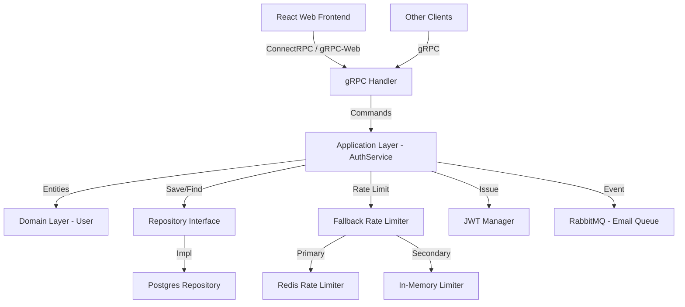

# Advanced Engineer Challenge - Auth Service

Модуль аутентификации, реализованный с использованием современных архитектурных паттернов (DDD, CQRS) и промышленного стека технологий.

## Технологический стек

- **Язык**: Go (1.25+) - выбран за высокую производительность, отличную поддержку gRPC и строгую типизацию, идеальную для DDD.
- **Frontend**: React (Vite) + ConnectRPC - для взаимодействия с backend по gRPC-Web.
- **API**: gRPC + Protobuf - для эффективного межсервисного взаимодействия и строгих контрактов.
- **БД**: PostgreSQL 15 - надежное реляционное хранилище со строгой консистентностью.
- **Очередь сообщений**: RabbitMQ - для асинхронной доставки уведомлений (сброс пароля). Возможная альтернатива Kafka.
- **Кэш/Rate Limit**: Redis 7 - для сессий и защиты от перебора паролей.
- **Infrastructure**: Docker Compose - для обеспечения IaC (Infrastructure as Code) и легкого развертывания.

## Архитектура

Проект построен по принципам **Clean Architecture** и **DDD**.

### DDD (Domain-Driven Design)
- **Bounded Context**: `IdentityAccess`. Все операции с доступом выделены в один контекст.
- **Aggregate Root**: `User` (`internal/domain/user.go`). Является корнем агрегата, управляет инвариантами пользователя.
- **Value Objects**: `Email`, `UserID`. Гарантируют валидность данных на уровне типа.
- **Domain Security**: Интерфейс `TokenManager` определен в домене (`internal/domain/security.go`), отделяя бизнес-потребность в авторизации от технической реализации JWT.

### CQRS (Command Query Responsibility Segregation)
- **Command Side**: Реализована в `AuthCommandService`. Команды (`Register`, `Login`, `ResetPassword`) изменяют состояние системы.
- **Query Side**: Реализована в `AuthQueryService`. Позволяет эффективно читать данные без побочных эффектов.
- **Separation**: Бизнес-логика (Application Layer) не знает о существовании gRPC или PostgreSQL, она работает с абстракциями (Repository).

### Безопасность
- **Хеширование паролей**: Используется `Argon2id` для защиты паролей (рекомендация OWASP). Рассмотренная альтернатива `Bcrypt`, но он уязвим для GPU атак.
- **Безопасный сброс пароля**: 
    - В базе данных хранятся только **SHA-256 хеши** токенов сброса.
    - Оригинальные токены передаются через **RabbitMQ** для отправки пользователю.
    - Новая генерация токена автоматически **аннулирует** все предыдущие токены пользователя.
- **Tokens**: JWT с разделением на Access и Refresh токены.
- **Rate Limiting (Защита от DDoS и Brute-force)**: 
    - **Global IP Limit**: Реализован через gRPC-интерцептор (`internal/infra/grpc/interceptor_rate_limit.go`), который ограничивает общее количество запросов с одного IP-адреса (100 запросов в минуту), корректно обрабатывая заголовок `X-Forwarded-For` для пользователей за NAT/Proxy.
    - **Endpoint Limits**: Точечные лимиты в слое инфраструктуры (`internal/infra/redis`) для критичных эндпоинтов:
        - `Login`: 5 попыток в 5 минут (по email).
        - `Register`: 3 попытки в 10 минут (по email).
        - `Password Reset`: строгие лимиты на инициализацию (3 попытки в 15 минут) и завершение сброса пароля (5 попыток в 15 минут).
    - **High Availability (Резервирование)**: Интегрирован In-Memory Fallback (`internal/infra/limiter/fallback.go` и `internal/infra/memory/rate_limiter.go`). При недоступности Redis запросы прозрачно обрабатываются резервным потокобезопасным in-memory ограничителем, предотвращая отказ в обслуживании.

## Как запустить

### Требования
- Docker & Docker Compose

### Настройка окружения
Необходимые секреты и конфигурации передаются через переменные среды. Создайте файл `.env` в корне проекта с нужными значениями.
Для локального запуска вне Docker можно использовать скрипт `setup_env.sh`, который засорсит переменные из `.env`:
  ```bash
   source setup_env.sh
   ```

### Команды
1. Сборка и запуск всех сервисов:
   ```bash
   make docker-up
   ```

2. Остановка всех сервисов:
   ```bash
   make docker-stop
   ```

3. Удаление всех сервисов:
   ```bash
   make docker-down
   ```

4. Запуск тестов:
   ```bash
   go test ./...
   ```

### Порты и Observability стек (Grafana, Prometheus, Loki, Tempo)

- **Доступ к приложениям**:
  - Web Frontend: `http://localhost:3000`
  - Страница восстановления пароля: `http://localhost:3000/reset-password?token=<token>`
  - Backend gRPC API: порт `50051`

- **Доступ к инфраструктуре**:
  - Grafana: `http://localhost:3001` (логин/пароль: `admin` / `admin`)
  - Prometheus: `http://localhost:9090`
  - Loki API: `http://localhost:3100`
  - Tempo API: `http://localhost:3200`
  - RabbitMQ Management: `http://localhost:15672` (логин/пароль: `guest` / `guest`)

- **Что уже настроено**:
  - Go‑сервис отправляет трейсы в OpenTelemetry Collector по OTLP.
  - Collector экспортирует данные в Tempo, Prometheus и Loki.
  - Grafana сконфигурирована со всеми источниками данных.


## Архитектурная схема (Mermaid)



## Ключевые компромиссы (Trade-offs)
- **gRPC vs REST**: Выбран gRPC как основной протокол для производительности и типобезопасности.
- **RabbitMQ**: Внедрен для разделения ответственности (Decoupling) между сервисом аутентификации и сервисом уведомлений, для обеспечения асинхронной доставки уведомлений. Т.к. в рамках данного проекта сервис уведомлений не реализован, токены отправляются в RabbitMQ в открытом виде. В реальной ситуации это не является безопасным решением, для обеспечения безопасности токены должны быть зашифрованы, например AES-256-GCM.
- **Hashed Tokens**: Выбраны вместо хранения в открытом виде для обеспечения безопасности данных (Data-at-Rest).
- **Docker Compose**: Использован для быстрого развертывания и тестирования. В реальной ситуации для обеспечения безопасности и надежности рекомендуется использовать Kubernetes.

## Дальнейшие шаги (Production Readiness)

Для полноценного запуска проекта в Production среде рекомендуется выполнить следующие инфраструктурные и архитектурные шаги:

- **CI/CD Pipeline**: Настройка автоматизированного запуска тестов, линтеров (`golangci-lint`), сборки образов и деплоя с использованием GitHub Actions или GitLab CI.
- **Оркестрация (Kubernetes)**: Переход от `docker-compose` к полноценному кластеру (K8s) с использованием Helm или Kustomize для обеспечения горизонтального масштабирования (HPA), отказоустойчивости и Zero-Downtime деплоя.
- **Управление секретами**: Внедрение специализированных решений вроде HashiCorp Vault, AWS Secrets Manager или GCP Secret Manager вместо использования переменных окружения.
- **Базы данных и кэш**: Использование отказоустойчивых Managed-решений (например, AWS RDS) с настроенными бэкапами, репликацией (Master-Replica) и пулером соединений (PgBouncer). Для Redis — настройка Redis Sentinel или Cluster.
- **API Gateway / Ingress**: Настройка Ingress-контроллера (NGINX/Envoy) с терминацией SSL/TLS-трафика, защитой от DDoS на уровне приложения (WAF) и централизованным управлением CORS.
- **Безопасность очередей**: Обязательное шифрование (например, AES-256-GCM) всех чувствительных payload'ов (токенов восстановления), передаваемых через RabbitMQ/Kafka.
- **Алертинг и мониторинг**: Настройка автоматических уведомлений в случае аномалий или превышения порогов ошибок через Alertmanager (с интеграцией в Telegram, Slack или PagerDuty).
- **Graceful Degradation & Circuit Breaker**: Внедрение паттернов защиты для взаимодействия с внешними системами для предотвращения каскадных сбоев.
